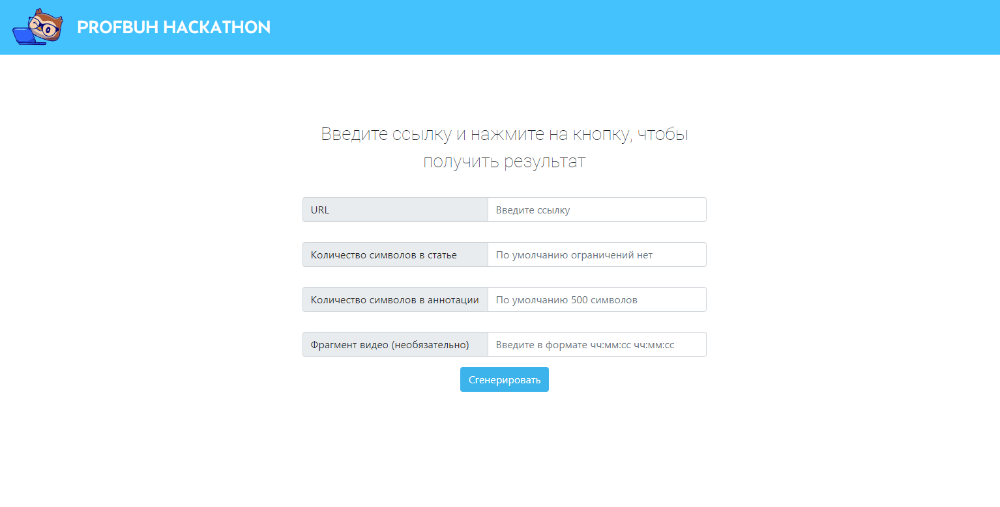
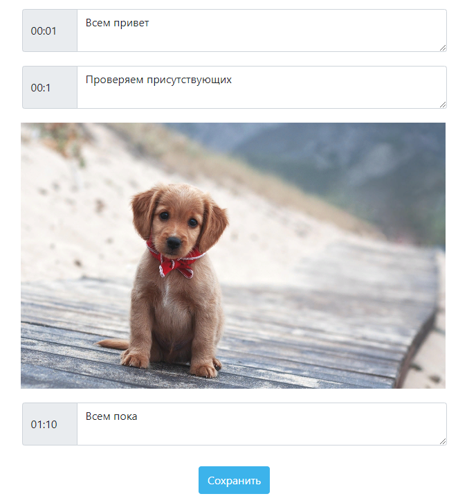
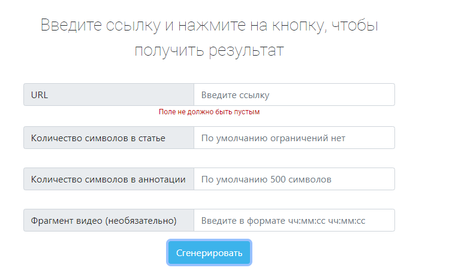

# profbuh

## Project setup
```
npm install
```

### Compiles and hot-reloads for development
```
npm run serve
```
Задачей хакатона от компании Профбух при поддержке Акселератора возможностей МГУ являлось создание веб-сервиса по генерации статей из видео по таймингам из него, а также вынесению важной информации благодаря скриншотам, если экран на видео не менялся в течение n минут. Это был мой первый опыт участия в хакатонах, я была frontend-разработчиком. 




 

К сожалению, серверная часть у данного проекта полностью отсутствует, но планировалось введение запросов на получение транскрибаций видео, их деление на абзацы в соответствии со временем, а также выведение этого текста в input-элементы для последующего ручного редактирования. В результате по нажатии кнопки "сохранить" пользователь бы видел готовую оформленную статью на html-странице, а также имел возможность сохранить материал в формате .doc и .html для более легкого редактирования и отображения.